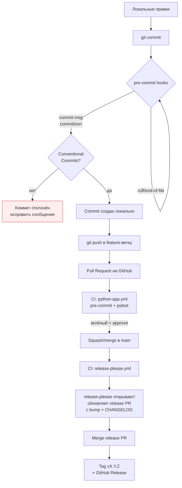
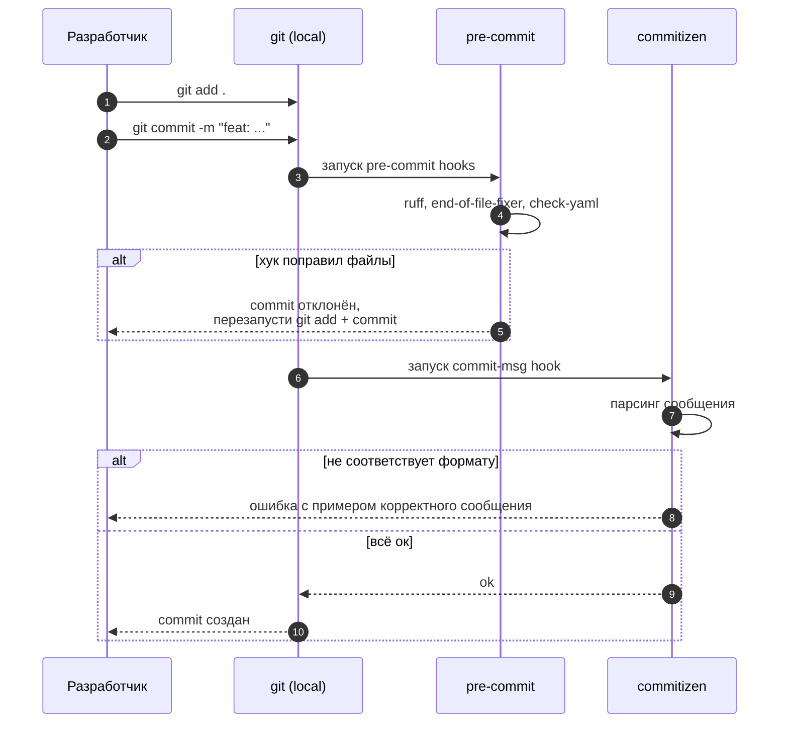
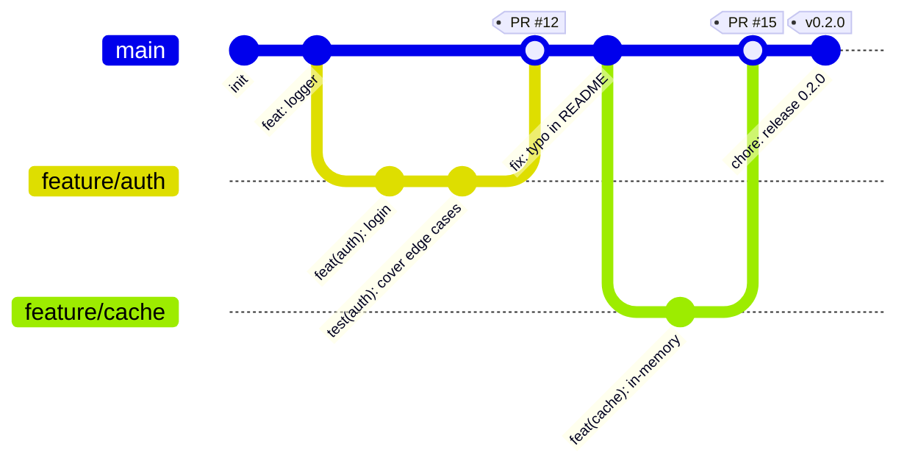
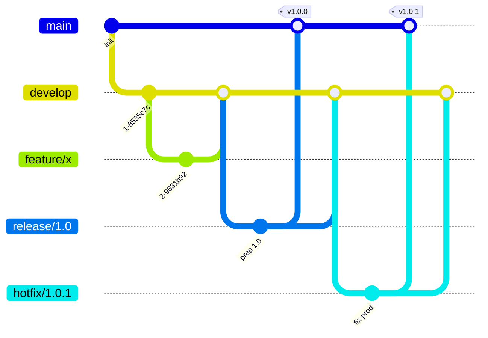
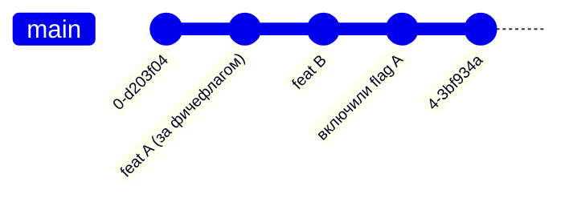
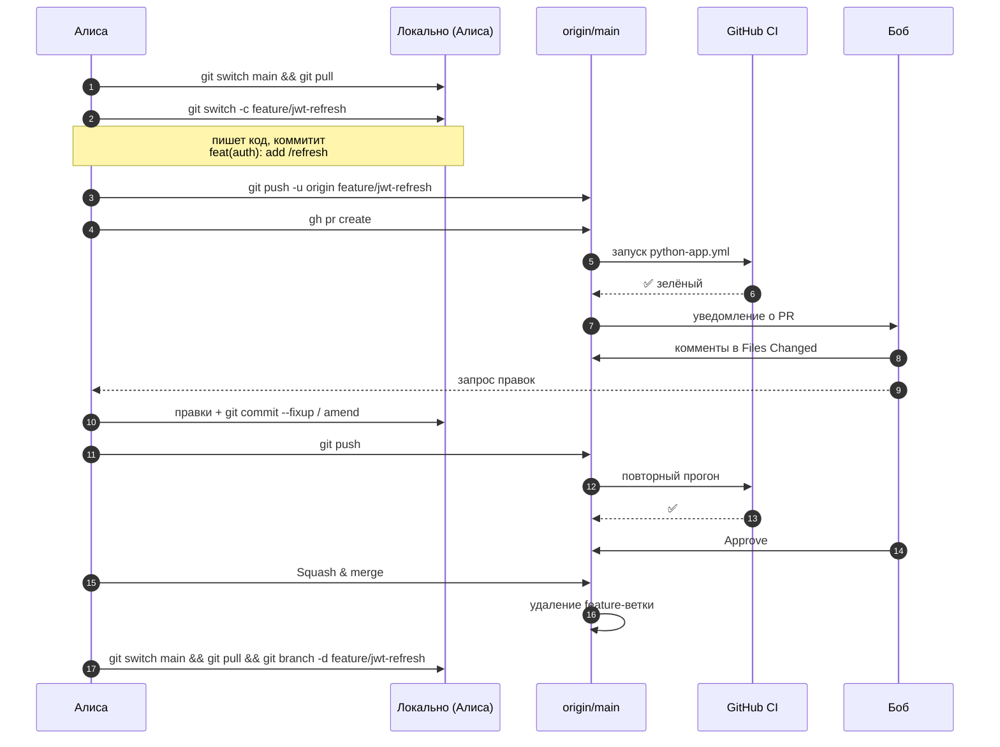
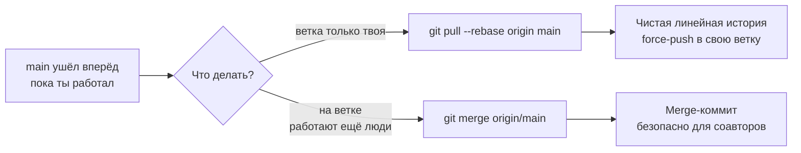
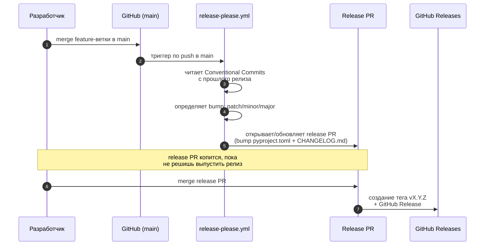
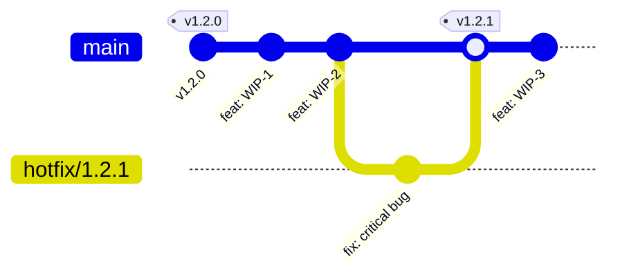

# Workflow: как это всё работает

Документ описывает полный цикл — от первого `git commit` до GitHub Release — и
как организовать командную работу через feature-ветки.

> Все диаграммы написаны на [Mermaid](https://mermaid.js.org/). GitHub
> рендерит их автоматически. Локально посмотреть можно в VS Code с плагином
> *Markdown Preview Mermaid Support*.

---

## 1. Большая картина



Главное: **сообщения коммитов — это и есть «исходник» changelog'а**. Поэтому их
формат жёстко проверяется на этапе `git commit`, до того как код вообще
попадает на сервер.

---

## 2. Conventional Commits — формат сообщений

```
<type>(<scope>)!: <subject>

<body>

<footer>
```

`type` обязателен, остальное опционально. `!` после типа/скоупа означает
breaking change.

| Type       | Когда использовать                              | Попадает в CHANGELOG как |
|------------|--------------------------------------------------|--------------------------|
| `feat`     | Новая функциональность                          | **Features**             |
| `fix`      | Исправление бага                                 | **Bug Fixes**            |
| `perf`     | Улучшение производительности                     | **Performance**          |
| `refactor` | Рефакторинг без изменения поведения              | **Refactor**             |
| `docs`     | Только документация                              | **Documentation**        |
| `test`     | Добавление/правка тестов                         | **Tests**                |
| `build`    | Сборка, зависимости (pyproject.toml, poetry.lock)| **Build System**         |
| `ci`       | GitHub Actions, pre-commit                       | **CI**                   |
| `style`    | Форматирование, точки с запятой и т.п.           | **Styling**              |
| `chore`    | Рутина, без влияния на код                       | **Miscellaneous**        |
| `revert`   | Откат прошлого коммита                           | **Revert**               |

**Примеры:**

```bash
git commit -m "feat(auth): add JWT refresh endpoint"
git commit -m "fix(logger): correct rotation when file is locked"
git commit -m "feat(api)!: drop v1 endpoints"          # breaking
git commit -m "refactor: extract config loader into module"
```

Для breaking change можно либо `!`, либо футер:

```
feat(api): switch to httpx

BREAKING CHANGE: requests dependency removed; clients must use httpx.
```

`release-please` смотрит на эти типы и решает, как менять версию:

- `BREAKING CHANGE` → **major** (1.2.3 → 2.0.0)
- `feat:` → **minor** (1.2.3 → 1.3.0)
- `fix:` / `perf:` → **patch** (1.2.3 → 1.2.4)
- остальное → версия не меняется

> Пока в проекте версия `0.x.y`, опция `bump-minor-pre-major` в
> `release-please-config.json` держит breaking change на уровне minor, а не
> major — это нормально для проекта, ещё не выпустившего `1.0.0`.

---

## 3. Локальный цикл разработки



Если запутался в формате — есть интерактивный режим:

```bash
poetry run cz commit     # пройдёт по шагам и соберёт сообщение
```

---

## 4. Ветки — какие стратегии бывают

Три популярных модели:

### GitHub Flow (рекомендую для этого шаблона)



- Одна долгоживущая ветка: `main`.
- Любая работа — короткая feature-ветка, обычно 1–3 дня.
- Merge через PR с code review и зелёным CI.
- Релиз = тег на `main`.
- Подходит для small/medium команд, SaaS, шаблонов, OSS-библиотек.

### Git Flow (классика, тяжеловесная)



- Ветки: `main`, `develop`, `feature/*`, `release/*`, `hotfix/*`.
- Имеет смысл, когда у тебя **версионируемый продукт с несколькими
  поддерживаемыми мажорными версиями** (типа Django LTS).
- Для большинства проектов — overkill. Дольше merge'ить, легче запутаться.

### Trunk-Based Development



- Все коммитят прямо в `main` (или через очень короткие ветки на часы).
- Незаконченные фичи прячутся за feature flags.
- Требует мощного CI и фича-флагов. Хорошо для команд 50+ с continuous
  deployment. Для шаблона — преждевременная оптимизация.

### Сводка

| Критерий                     | GitHub Flow | Git Flow      | Trunk-Based |
|------------------------------|-------------|---------------|-------------|
| Долгоживущие ветки           | 1 (`main`)  | 2+            | 1 (`main`)  |
| Сложность                    | Низкая      | Высокая       | Средняя     |
| Размер команды               | 2–20        | 5+            | 10+         |
| Нужны feature flags          | Опционально | Нет           | Да          |
| Continuous deployment        | Подходит    | Не очень      | Идеально    |
| **Подходит этому шаблону**   | **Да**      | Нет           | Нет         |

---

## 5. Командный workflow по шагам (GitHub Flow)

Допустим, нас двое: **Алиса** (автор) и **Боб** (ревьюер).



**Конкретные команды у Алисы:**

```bash
# 1. Свежий main
git switch main
git pull --ff-only

# 2. Новая ветка
git switch -c feature/jwt-refresh

# 3. Работа + коммиты
# ... правки ...
git add app/auth/
git commit -m "feat(auth): add /refresh endpoint"
git commit -m "test(auth): cover refresh edge cases"

# 4. Пуш и PR
git push -u origin feature/jwt-refresh
gh pr create --title "feat(auth): JWT refresh" --body "Closes #42"

# 5. После ревью — правки
git commit -am "fix(auth): handle expired refresh tokens"
git push

# 6. После merge — уборка
git switch main
git pull --ff-only
git branch -d feature/jwt-refresh
```

### Несколько правил, которые сильно экономят нервы

1. **Маленькие PR.** Лучше три PR по 200 строк, чем один на 600. Ревью качественнее, конфликты реже.
2. **Одна тема на ветку.** Не смешивай рефакторинг с фичей.
3. **Имена веток:** `feature/<кратко>`, `fix/<кратко>`, `chore/<кратко>`. Например `feature/jwt-refresh`, `fix/logger-rotation`.
4. **Защити main.** В Settings → Branches: require PR, require CI green, require 1 approval, dismiss stale reviews on push.
5. **Squash merge по умолчанию.** Тогда история `main` остаётся одной строкой коммитов в Conventional-формате и changelog получается чистым. Сообщение squash-коммита редактируй вручную в формате CC.
6. **Никогда не push --force в main.** В свою feature-ветку — можно (после rebase), но согласуй с ревьюером, если он уже смотрит.

---

## 6. Rebase или merge?



Правило: **rebase для своих веток, merge для общих**. После rebase нужен
`git push --force-with-lease` (безопаснее `--force`: не перезапишет чужие
коммиты, которые ты ещё не видел).

---

## 7. Релиз — что делает release-please

Никаких ручных `cz bump` и тегов. Версия, `CHANGELOG.md`, тег и GitHub Release —
всё автоматизировано через [release-please](https://github.com/googleapis/release-please).
Твоя задача — просто мержить корректные Conventional Commits в `main`.



Что увидит пользователь:
- Пока есть невыпущенные изменения — открытый **release PR** с предпросмотром bump и changelog.
- После merge release PR: тег `vX.Y.Z`, GitHub Release и обновлённый [CHANGELOG.md](../CHANGELOG.md).
- Текущая выпущенная версия хранится в [.release-please-manifest.json](../.release-please-manifest.json).

> Для работы action включи в **Settings → Actions → General → Workflow
> permissions**: «Read and write permissions» и «Allow GitHub Actions to create
> and approve pull requests».

---

## 8. Хотфикс на проде

Если на `main` уже накопились незавершённые `feat:`, а на проде нужно срочно
поправить один баг:



Если незавершённые фичи на `main` **не deployable** — придётся откатиться к
тегу, создать ветку от него, пофиксить, выпустить, потом мержить в `main`:

```bash
git switch -c hotfix/1.2.1 v1.2.0
# ... фикс ...
git commit -m "fix(api): null pointer in /users"
git push origin hotfix/1.2.1
# дальше PR hotfix/1.2.1 -> main; release-please сам поднимет patch и выпустит релиз
```

Это редкий сценарий, и если он у тебя случается часто — пора смотреть в
сторону feature flags или Git Flow.

---

## 9. Что лежит за этим в репо

| Файл                                      | Что делает                                                       |
|-------------------------------------------|------------------------------------------------------------------|
| [.pre-commit-config.yaml](../.pre-commit-config.yaml) | Запускает ruff и commitizen на каждом `git commit`               |
| [pyproject.toml](../pyproject.toml) (`[tool.commitizen]`) | Валидация Conventional Commits (commit-msg hook)                 |
| [release-please-config.json](../release-please-config.json) | Конфиг release-please: release-type, changelog, правила bump    |
| [.release-please-manifest.json](../.release-please-manifest.json) | Текущая выпущенная версия (ведёт release-please)                |
| [.github/workflows/python-app.yml](../.github/workflows/python-app.yml) | CI на каждый PR: lint + tests                                    |
| [.github/workflows/release-please.yml](../.github/workflows/release-please.yml) | На push в `main`: release PR → тег + GitHub Release             |
| [CHANGELOG.md](../CHANGELOG.md)           | Авто-сгенерированная история. Руками **не редактировать**.       |

---

## TL;DR

1. Commit-сообщения пишем по Conventional Commits — без этого коммит не пройдёт.
2. Каждая задача — отдельная короткая ветка `feature/...`, через PR в `main`.
3. На `main` всегда зелёный CI, всегда deployable.
4. Релиз: ничего не бампим руками — release-please копит release PR; мерж PR = новый тег и Release.
5. CHANGELOG.md и Release Notes никто руками не пишет — они генерируются из истории коммитов.
